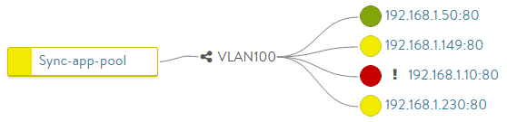

Avi Vantage must validate whether servers are working correctly and are able to accommodate additional workloads before load balancing a client to a particular server. Health monitors perform this function by either actively sending a synthetic transaction to a server or by passively monitoring client experience with the server. Vantage sends active health monitors on a periodic basis that originate from Service Engines hosting the virtual service.

* The health monitors are attached to a pool for the virtual service.
* A pool that is not attached to a virtual service will not send health monitors and is considered an inactive config.
* A pool may have multiple actively concurrent health monitors (such as Ping, TCP, and HTTP), as well as a passive monitor.
* All active health monitors must be successful for the server to be marked up

See also:

* <a href="/why-is-a-server-marked-down/">Reasons a Server Marked Down</a>
* <a href="/health-monitor-troubleshooting/">Health Monitor Troubleshooting</a>
* <a href="/servers-flapping-up-down/">Servers Flap Up / Down</a>
* <a href="/manually-validate-server-health/">Manually Validate Server Health</a>

### Active Health Monitors

Active health monitors proactively send queries to servers, synthetically mimicking a client. Send and receive timeout intervals may be defined, which statically determines the server response as successful or failed.

Active health monitors originate from the Service Engines hosting the virtual service. Each SE must be able to send monitors to the servers, which ensures there are no routing or intermediate networking issues that might prevent access to a server from all active Service Engines. If one SE marks a server up and another SE marks a server down, each SE will include or exclude the server from load balancing according to their local monitor results.

### Passive Health Monitor

While active health monitors provide a binary good/bad analysis of server health, passive health monitors provide a more subtle check by attempting to understand and react to the client-to-server interaction. An active health monitor sends a periodic check to the servers that mimics an end user transaction with a synthetic request, then statically validates the response against an expected string. Passive health monitors do not send a check to the servers. Instead, Vantage monitors end user interaction with the servers. If a server is quickly responding with valid responses (such as HTTP 200), then all is well; however, if the server is sending back errors (such as TCP resets or HTTP 5xx errors), the server is assumed to have errors. Errors are defined by the analytics profile attached to the virtual service. The analytics profile also defines the threshold for response time before a server is considered responding slowly.

With active health monitors, Vantage will mark a server down after the specified number of consecutive failures and will no longer send new connections or requests until that server is able to correctly pass the periodic active health monitors.

With passive health monitors, server failures will not cause Vantage to mark that server as down. Rather, the passive health monitor will reduce the number of connections or requests sent to the server relative to the other servers in the pool by about 75%. Further failures may increase this percentage. After a server is satisfactorily handling the reduced load, it will once again be sent normal volumes of traffic.

**Note**:  Best practice is to enable both a passive and an active health monitor to each pool.