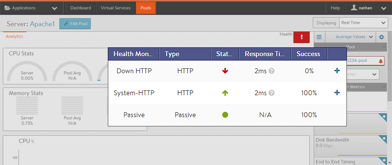

Server flapping, or bouncing between up and down, is a common issue. Generally, server flapping is caused by the server reaching or slightly exceeding the health monitor's maximum allowed response time.

To validate whether a server is flapping, drill into the specific server's analytics page within the pool. Enable the Alerts and System Events overlay icons for the main chart. This will show server up and down events over the time period selected. The page also shows which health monitors are failing.

Compare the response times from the server to the health monitor's configured receive timeout window. If the failures can be attributed to these timers, there are several steps that can be taken to remedy.

* **Add additional servers.** This may not help if the slowdown is due to a backend database, but for servers that are simply busy or overloaded, this may be a quick and permanent fix.
* **Increase the health monitor's receive timeout window.** The timeout value can be 1-300 seconds. The timeout value must always be shorter than the send interval for the health monitor.
* **Raise the number of successful checks required, and decrease the number of failed checks allowed.** This will ensure the server is not brought back into the rotation as quickly, potentially giving it more time to handle the processes that are causing the slow response.
* **Change the connection ramp-up (if using the least connections load-balancing algorithm).** Servers may be susceptible to receiving too many connections too fast when first brought up. For example, if one server has 1 connection and the rest have 100 connections, the least connections algorithm says the new server should get the next 99 connections. This can easily overwhelm the server, leaving a flash crowd of connections that must be dealt to the remaining servers, causing a domino effect. The connection ramp-up feature can be configured on the advanced tab of the pool's configuration. The connection ramp-up feature slowly ramps up the percentage of new connections sent to a new server. Increasing the ramp-up time may be beneficial if you are seeing a cascading failure of servers.
* **Set the maximum number of connections per server.** This option, configurable on the Advanced tab of the pool configuration, ensures that servers are not overloaded and are able to handle connections at optimal speed.