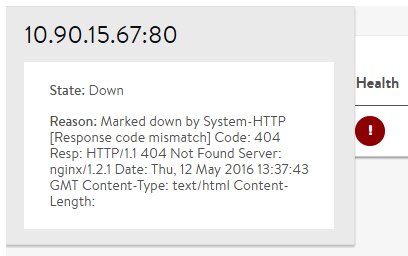
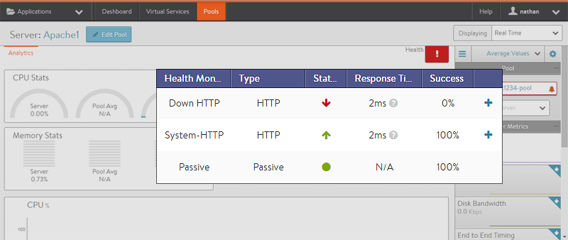

Servers within a pool may have a status of up, down, or disabled (administratively disabled by an administrator).  The status is determined by the associated <a href="/overview-of-health-monitors/">health monitors</a> applied to the server pool.

Vantage may mark a server down for a number of reasons.  The reason a server is marked down may be accessed three different ways. All methods show roughly the same information.

* **Down Health Score Icon**:  Hover the mouse over a server's red status icon in the UI.

* **Down Event**:  Navigate to the events for the server, the pool, the virtual service.  Expand the event to see full details.  This information can be used to automatically generate an alert and potentially make further system changes.  See the <a href="/alerts-overview/">alerts overview</a> for more info.
* **Server Page**:  Navigate to Applications > Pools > *pool-name* > Servers > *server-name*. This displays the analytics page for the server.
In this example, the "Down-HTTP" monitor is marking the server down, whereas the "System-HTTP" monitor is reporting the server as up.
Note: The Passive monitor is a special type. A passive monitor will not mark a server down. Instead, if a passive monitor detects bad server-to-client responses, the monitor reduces the percentage of traffic load balanced to that server.
Click the plus sign next to the health monitor to show additional information regarding the server's health status.

## Common Reasons a Server May Be Marked Down

* **ARP Unresolved**: The Service Engine was unable to resolve the MAC address of the server's IP address (when in the same layer 2 domain) or was unable to initiate a TCP connection (when the server is a layer 3 hop away).
* **Payload Mismatch**: The health monitor expects specific content to be returned in the body of the response (HTTP or TCP). In the example, an excerpt of the server's response is shown. Often this type of error occurs when a server's first response is to send a redirect to a client. The expected content appears in the client browser, but from Vantage's perspective the client received a redirect.
* **Response Code Mismatch**: HTTP health checks may be configured to expect a specific response code, such as 2xx.  Meanwhile, the server may be sending back a different code, such as 404.
* **Failed to Meet SLA**: Health monitors expect a valid response within a designated period of time. If a response (valid content or not) is returned from the server but arrives after the maximum allowed time, the monitor will mark the server down.

While Vantage is engineered for easy troubleshooting, there are times when more advanced tools may be required. At these times, it may be useful to capture a trace of the conversation between the SE and the server. (Navigate to Operations > <a href="/docs/configuration-guide/operations/traffic-capture/">Traffic Capture</a>.)

Tools such as ping and curl may prove useful when launched from a client machine to the server. However, these tools may not be reliable when executed by administrators from SEs. This is due to the dual network stacks used for the data plane and management. For example, a tool such as ping is executed from Linux using the SE management IP and network.  The results may be different than the SE is reporting when it is health checking via its data NICs and networks.  For the ping example, use *ping -l* to verify the interface used.